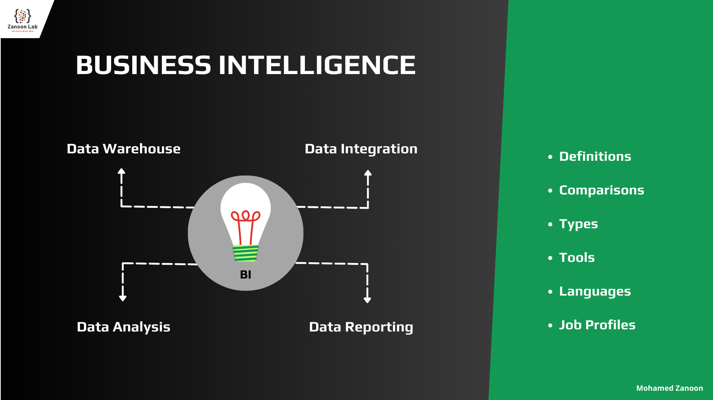

# Brief on Business Intelligence (BI)

## Business Intelligence (BI):

Comprises the strategies and technologies used by enterprises for the data analysis and management of business information. Common functions of business intelligence technologies include reporting, online analytical processing, analytics, dashboard development, data mining, process mining, complex event processing, business performance management, benchmarking, text mining, predictive analytics, and prescriptive analytics. 

Also, Processes (Activities)  using software and services to transform data into actionable insights that inform an organization's business decisions.

#### BI Processes:
1. Data Warehouse: To Storage the data.
2. Data Integration: To extract, Transform, Clean and Load the data.
3. Data Analysis: To extract useful information from data.
4. Data Reporting: to format the data into a digestible format.

-----------------------------------------------------------------------------------------

## ✨ 1. Data Warehouse (DW / DWH):

A **data warehouse** is a type of data management system that is designed to enable and support business intelligence (BI) activities, especially analytics to help an organization make decisions.

The concept of the data warehouse has existed since the 1980s, when it was developed to help transition data from merely powering operations to fueling decision support systems that reveal business intelligence. The large amount of data in data warehouses comes from different places such as internal applications such as marketing, sales, and finance; customer-facing apps; and external partner systems, among others.

Also known as an **enterprise data warehouse (EDW)**.

-   **Data Warehouse** vs. **Database**

It's easy to confuse a data warehouse with a database, since both concepts share some similarities. The primary difference, however, comes into effect when a business needs to perform analytics on a large data collection. Data warehouses are made to handle this type of task, while databases are not.

-   **Data Warehouse** vs. **Data Lake**

Although they both are built for business analytics purposes, the major difference between a data lake and a data warehouse is that a data lake stores all types of raw, structured, and unstructured data from all data sources in its native format until it is needed. By contrast, a data warehouse stores data in files or folders in a more organized fashion that is readily available for reporting and data analysis.

-	**Data Warehouse** vs. **Data Mart**

Data warehouses are also sometimes confused with data marts. But data warehouses are generally much bigger and contain a greater variety of data, while data marts are limited in their application.
Data marts are often subsets of a warehouse, designed to easily deliver specific data to a specific user, for a specific application. In the simplest terms, data marts can be thought of as single-subject, while data warehouses cover multiple subjects.

### The Data Warehouse Pioneers:

#### Ralph Kimball

(born 1944) is an author on the subject of data warehousing and business intelligence.

-	He is one of the original architects of data warehousing.
-	Dimensional Modeling or the Kimball Methodology (Star Schema/Snowflake Schema).
-	Slowly Changing Dimension (SCD).
-	The Principal author of the best-selling books **The Data Warehouse Toolkit**, The Data Warehouse Lifecycle Toolkit, The Data Warehouse ETL Toolkit and The Kimball Group Reader, published by Wiley and Sons.
-	Kimball's approach is often characterized as a **bottom-up** approach also known as **dimensional modeling** or the **Kimball methodology**.

#### Bill Inmon

(born 1945) is an American computer scientist, recognized by many as the father of the data warehouse. 

-	Recognized by many as the father of the data warehouse.
-	Inmon created the accepted definition of what a data warehouse is - a subject oriented, nonvolatile, integrated, time variant collection of data in support of management's decisions. 
-	The Principal author of book **Corporate Information Factory**.
-	Inmon's approach is often characterized as a **top-down** approach.

#### Daniel Linstedt (Dan Linstedt)

is the inventor of the Data Vault Architecture (now deemed Data Vault 1.0) and Data Vault 2.0., and a world-renowned expert in Data Warehousing and Business Intelligence.

-	Author & Inventor of **Data Vault Modeling** 1.0 and 2.0.
-	CEO at LearnDataVault.com
-	The Principal author of books Building a Scalable Data Warehouse with Data Vault 2.0 and Super Charge Your Data Warehouse.

### Tools:
-	Microsoft: 
    -   Azure Synapse Analytics / Dedicated SQL pool (formerly SQL DW)
    -   Azure SQL Database
    -   SQL Server Database
-	IBM: 
    -   Netezza
    -   Db2 Warehouse
-	Amazon: 
    -   Redshift
-	Oracle
    -   Oracle
-	Teradata:
    -   Teradata Database
    -   Teradata Data Warehousing Solutions
-	PostgreSQL
-	MySQL

### Languages: 
-   SQL

### Job Profiles: 
-   Data Modeler
-   Data Architect

-----------------------------------------------------------------------------------------

## ✨ 2. Data Integration:

**Data Integration** is the process of combining data from different sources into a single, unified view. Integration begins with the ingestion process, and includes steps such as **cleansing**, **ETL/ELT mapping**, and **transformation**.

#### Extract, Transform and Load (ETL): 
Copies of datasets from disparate sources are gathered together, harmonized, and loaded into a data warehouse or database.

#### Extract, Load and Transform (ELT): 
Data is loaded as is into a big data system and transformed at a later time for particular analytics uses.

#### Data Cleaning: 
Data Cleaning is the process of fixing or removing incorrect, corrupted, incorrectly formatted, duplicate, or incomplete data within a dataset.

### Tools:
-	Microsoft: 
    -   Azure Data Factory (ADF)
    -   Azure Databricks
    -   SQL Server Integration Services (SSIS)
-	IBM: DataStage (DS)
-	Amazon: 
    -   AWS Databricks
-	Oracle: 
    -   Oracle Data Integrator (ODI)
-	Talend
-	Jupyter Notebook

### Languages: *(based on the tool)*
-   NET (C#), SQL => SSIS
-   Talend => Java
-   Python, Scala, R, Java, or SQL => Azure Databricks, AWS Databricks
-   SQL, C or C++ (routines), Shell Scripting (bash) => DataStage 

### Job Profiles: 
-   Data Engineer
-   Data Integration Developer
-   Data Migration Developer

-----------------------------------------------------------------------------------------

## ✨ 3. Data Analysis:

**Data Analysis** is defined as a process of cleaning, transforming, and modeling data to discover useful information for business decision-making. The purpose of Data Analysis is to extract useful information from data and taking the decision based upon the data analysis.

A simple example of Data analysis is whenever we take any decision in our day-to-day life is by thinking about what happened last time or what will happen by choosing that particular decision. This is nothing but analyzing our past or future and making decisions based on it. For that, we gather memories of our past or dreams of our future. So that is nothing but data analysis. Now same thing analyst does for business purposes, is called Data Analysis.

### Types of Data Analysis: (Techniques and Methods)

#### -  Text Analysis:
Text Analysis is also referred to as **Data Mining**. It is one of the methods of data analysis to discover a pattern in large data sets using databases or data mining tools. It used to transform raw data into business information.

#### -	Statistical Analysis:
Statistical Analysis shows **"What happen?"** by using past data in the form of dashboards. Statistical Analysis includes collection, Analysis, interpretation, presentation, and modeling of data. It analyses a set of data or a sample of data. There are two categories of this type of Analysis (Descriptive Analysis and Inferential Analysis).

-   **Descriptive Analysis:**

Analyses **complete data or a sample of summarized numerical data**. It shows mean and deviation for continuous data whereas percentage and frequency for categorical data.

-   **Inferential Analysis:**

Analyses **sample from complete data**. In this type of Analysis, you can find different conclusions from the same data by selecting different samples.

#### -	Diagnostic Analysis:
Diagnostic Analysis shows **"Why did it happen?"** by finding the cause from the insight found in Statistical Analysis. This Analysis is useful to identify behavior patterns of data. If a new problem arrives in your business process, then you can look into this Analysis to find similar patterns of that problem. And it may have chances to use similar prescriptions for the new problems.

#### -	Predictive Analysis:
Predictive Analysis shows **"What will happen?"** by using previous data. The simplest data analysis example is like if last year I bought two dresses based on my savings and if this year my salary is increasing double then I can buy four dresses. But of course it's not easy like this because you have to think about other circumstances like chances of prices of clothes is increased this year or maybe instead of dresses you want to buy a new bike, or you need to buy a house!
So here, this Analysis makes predictions about future outcomes based on current or past data. Forecasting is just an estimate. Its accuracy is based on how much detailed information you have and how much you dig in it.

#### -	Prescriptive Analysis:
Prescriptive Analysis shows **"How can we make it happen?"** by combining the insight from all previous Analysis to determine which action to take in a current problem or decision. Most data-driven companies are utilizing Prescriptive Analysis because predictive and descriptive Analysis are not enough to improve data performance. Based on current situations and problems, they analyze the data and make decisions.

### Tools:
-	Microsoft: 
    -   Power BI
    -   Azure Analysis Services (AAS)
    -   SQL Server Analysis Services (SSAS)
    -   Azure Databricks
    -   Excel
    -   SQL Server Database
-	IBM: 
    -   Cognos Analytics (Dynamic Cube)
-	Amazon: 
    -   AWS Databricks
-	Teradata:
    -   Teradata Vantage
    -   Teradata Analytics Solutions
-	Jupyter Notebook
-   SAS Data mining

### Languages: *(based on the tool)*
-   M Language => Power BI, Excel
-   DAX => Power BI, AAS, SSAS
-   MDX => AAS, SSAS
-   Python, Scala, R, Java, or SQL => Azure Databricks, AWS Databricks
-   T-SQL => SQL Server Database
-   Python => Jupyter Notebook

### Job Profiles: 
-   Data Analyst
-   Business Analyst

-----------------------------------------------------------------------------------------

## ✨ 4. Data Reporting:
**Data Reporting** is the process of collecting and formatting raw data and translating it into a digestible format to assess the ongoing performance of your organization. It is the process of collecting and submitting data which gives rise to accurate analyses of the facts on the ground. Different from data analysis that transforms data and information into insights, data reporting is the previous step that translates raw data into information.

### Types of Data Reporting:

####    Detail Report
Detail Report is mainly for listing the data, such as sales list, customer list, expenditure list. To achieve these reports types, you can use widgets such as tables, lists, text boxes, and so on.

####    Paginated Report / Print Report
Is designed to be printed or shared. They're called paginated because they're formatted to fit well on a page. They display all the data in a table, even if the table spans multiple pages.

####    Chart Report / Interactive Report / Data Visualization
By presenting the data in different types of charts, the relationship between the data and the trend of the data can be better analyzed, which usually includes drill-down, drill-through, data filtering, data sorting and other methods.

### Tools:
-   Microsoft: 
    -   Power BI
    -   SQL Server Reporting Services (SSRS)
    -   Azure Databricks
    -   Excel
-   IBM: 
    -   Cognos Analytics (Reports/Dashboards)
-   Amazon:
    -   AWS Databricks
-   Tableau
-   Qlik
-   Jupyter Notebook

### Languages: *(based on the tool)*
-   M Language => Power BI, Excel
-   DAX => Power BI, SSRS
📞Python, Scala, R, Java, or SQL => Azure Databricks, AWS Databricks
-   Python => Jupyter Notebook

### Job Profiles: 
-   Data Visualization Developer

-----------------------------------------------------------------------------------------
-----------------------------------------------------------------------------------------

#### 📞 Contacts:
- LinkedIn: https://www.linkedin.com/in/mohamed-zanoon
- YouTube Channel: https://www.youtube.com/@ZanoonLab
- Facebook Group: https://www.facebook.com/groups/ZanoonLab